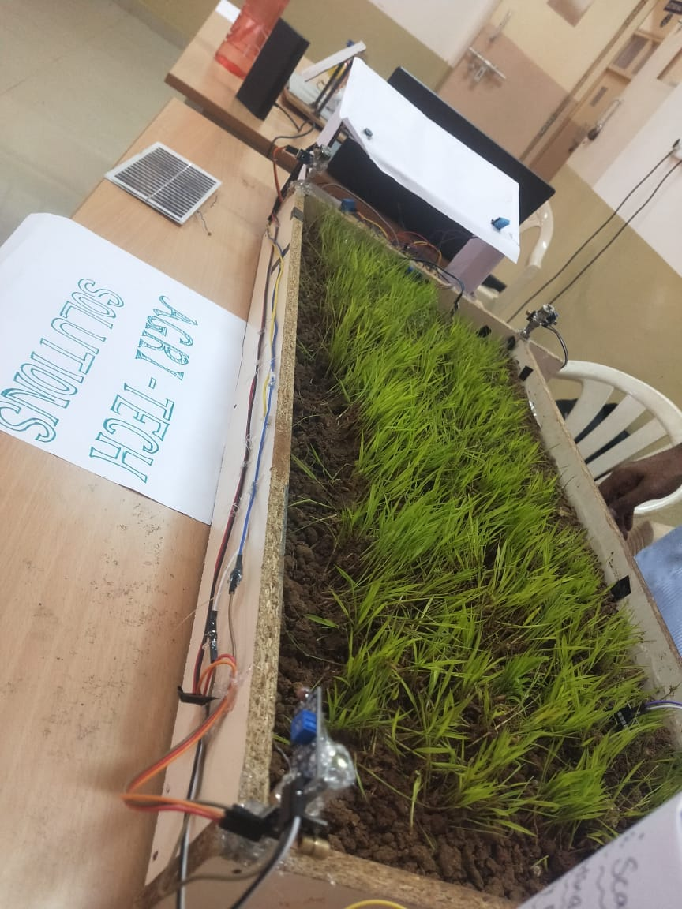
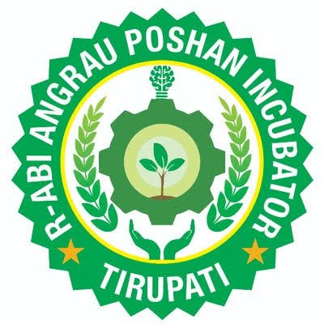
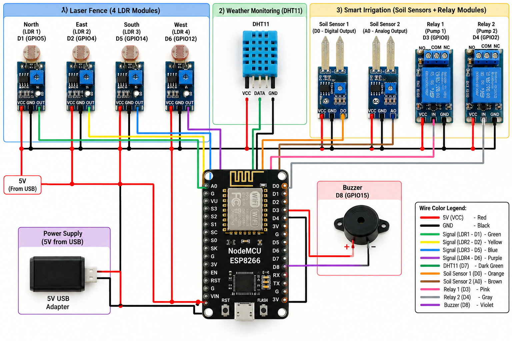

# Agri-Tech Solutions

A smart farming prototype built on a single ESP8266 (NodeMCU) and monitored from one Blynk IoT dashboard. It combines three features: a laser security fence to detect animals entering the field, soil-moisture-based irrigation for two separate regions, and live weather monitoring.

> **Status:** Working prototype
> **Type:** Team project

## Prototype

## Recognition

 &nbsp;&nbsp; 

This project was selected for **Sankalp 2023**.

| | |
|---|---|
| Program | Sankalp 2023 |
| Incubator | ANGRAU Incubator, Cohort 6 |
| Internship | Two-month internship at the Regional Agricultural Research Station, exploring agripreneurship |
| Outcome | Reached the final pitching round |

## Features

### 1. Laser security fence
Instead of electric fencing, each of the four borders of the field has a laser module pointing at an LDR module. The lasers are wired straight to power, so they stay on whenever the system is on. When an animal crosses a border it blocks the beam, the LDR reading changes, and the system:

- sounds a buzzer to scare the animal away
- lights the indicator for that border (North, East, South or West) on the Blynk dashboard
- sends a push notification that names the border that was crossed

### 2. Smart irrigation for two regions
Two soil moisture sensors are placed in different regions of the field. Each region has its own pump relay, so only the region that is dry gets water. The farmer can also switch either pump on from the app.

### 3. Weather monitoring
A DHT11 sensor sends the temperature and humidity of the field to the dashboard every few seconds.

## Components

| Component | Qty | Purpose |
|---|---|---|
| NodeMCU ESP8266 | 1 | Controller with Wi-Fi |
| Laser module | 4 | One beam per border, always on |
| LDR module | 4 | Detects when a beam is blocked |
| Soil moisture sensor | 2 | One per irrigation region |
| Relay module | 2 | Switches the pump for each region |
| DHT11 sensor | 1 | Temperature and humidity |
| Buzzer | 1 | Local alarm |
| Water pump(s) | - | Irrigation |
| 5 V USB adapter | 1 | Power supply |

## Circuit

| NodeMCU pin | Connected to |
|---|---|
| D1 | LDR module 1 (North border) |
| D2 | LDR module 2 (East border) |
| D5 | LDR module 3 (South border) |
| D6 | LDR module 4 (West border) |
| D0 | Soil sensor 1, digital output |
| A0 | Soil sensor 2, analog output |
| D3 | Relay 1 input (region 1 pump) |
| D4 | Relay 2 input (region 2 pump) |
| D7 | DHT11 data |
| D8 | Buzzer |

The sensors, relay modules and buzzer share a common 5 V supply and ground. The pump power supply, which is switched through the relay contacts, is not shown in the diagram.

## How it works

The code runs three small tasks on a timer:

| Task | How often | What it does |
|---|---|---|
| `checkLaserFence()` | 100 ms | Reads the four LDR modules. A blocked beam raises the buzzer, the dashboard indicator and a notification |
| `waterPlants()` | 1 s | Reads the two soil sensors and switches each region's pump on when the soil is dry, or when the farmer turns it on from the app |
| `sendWeather()` | 5 s | Reads the DHT11 and sends temperature and humidity to the dashboard |

An alert is sent only when a beam changes from clear to blocked, so one crossing gives one notification and not a flood of them.

## Blynk dashboard

| Virtual pin | Use | Widget |
|---|---|---|
| V0 | Temperature | Gauge |
| V1 | Humidity | Gauge |
| V2, V3 | Soil status, region 1 and 2 (Dry / Wet) | Label |
| V4, V5 | Pump state, region 1 and 2 | LED |
| V6, V7 | Manual pump switch, region 1 and 2 | Switch |
| V10 to V13 | Border status: North, East, South, West | LED |

Create an event named `intrusion` in the Blynk template and enable notifications for it. This is what produces the animal alert on your phone.

## Code

The full sketch is in [`code/code.ino`](code/code.ino).

Libraries needed (install from **Sketch → Include Library → Manage Libraries**):

- Blynk
- DHT sensor library (Adafruit)
- Adafruit Unified Sensor

To run it:

1. Create a Blynk template and device, and create the datastreams from the table above.
2. Open the sketch and replace the placeholders at the top with your template ID, auth token, Wi-Fi name and password.
3. Select **Board: NodeMCU 1.0 (ESP-12E Module)** and the correct port, then upload.
4. Open the Blynk dashboard to see the live data.

Never upload your real auth token or Wi-Fi password to GitHub. Keep the placeholders in the public copy.

## Setup notes

- Turn the small potentiometer on each LDR module until its output changes when you block the laser with your hand.
- Point each laser straight at its LDR. Strong direct sunlight on the LDR can hide a blocked beam.
- If the alarm sounds while the lasers are on target, or the pumps work the wrong way round, flip the `HIGH` and `LOW` levels in the code where the comments mention them.

## Limitations

- The ESP8266 has only one analog pin, so only one soil sensor can use its analog output. The other uses its digital output.
- Pumps run whenever the soil is dry and have no maximum run time.
- This is a small-scale prototype, not tested over a full field or in rain.

## Possible improvements

- Add a pump time limit and a rest period for safety
- Use an analog-to-digital converter chip to read both soil sensors as percentages
- Power the system from a solar panel and battery
- Log the weather and soil data over time to spot trends
